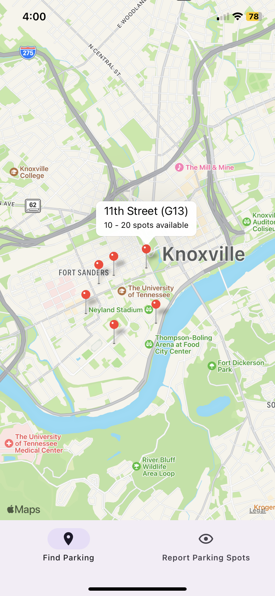
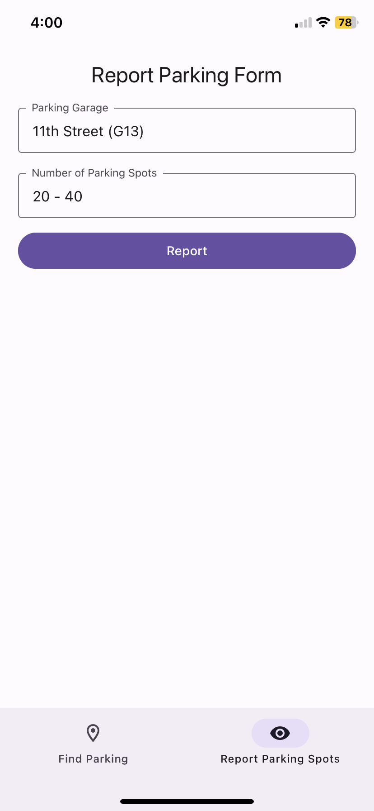

<h1 align="center">
  <br>
    
  <br>
    ParkUTK
  <br>
</h1>

<h2 align="center">A React Native app built with <a href="https://expo.dev/" target="_blank" rel="noreferrer">Expo</a> that helps you find parking.</h2>

<p align="center">
  
  
</p>

## 🔨 Installation and Usage

### 1. Fork the repository

### 2. Install dependencies

```sh
npm install
```

### 3. Start the development server

```sh
npx expo start
```

## 🤝 Contributing

Pull requests are welcome!

## 📖 License

[MIT](https://choosealicense.com/licenses/mit/)
